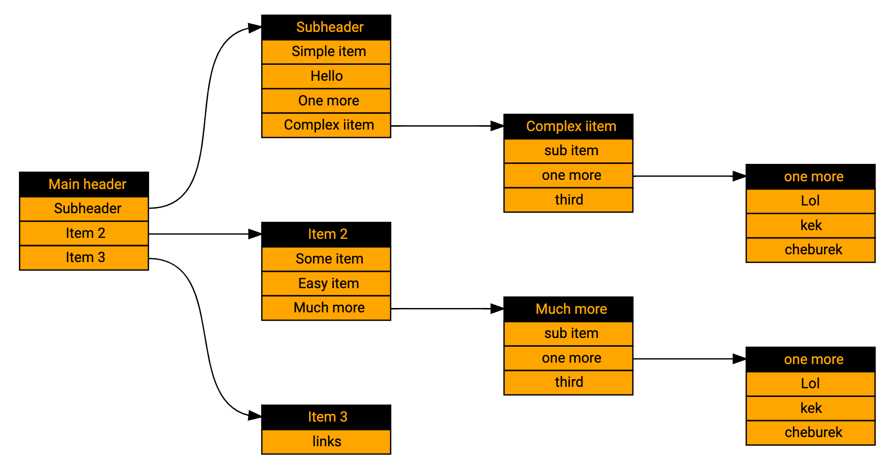

# Flipper Menu Tree Generator

Generates menu tree image from markdown code

I hack together small PoC. It takes MD file, uses parser library from @zhovner’s example (https://github.com/gera2ld/markmap-lib 2) (so, NO YAML), translate it to dot syntax (Graphviz) and produces following image:

It is not interactive, on the other hand, generation of images could be part of CI pipeline.

[live result](https://dreampuf.github.io/GraphvizOnline/#digraph%20g%20%7B%0D%0A%20%20%20%20graph%20%5B%0D%0A%20%20%20%20%20%20%20%20rankdir%20%3D%20%22LR%22%0D%0A%20%20%20%20%20%20%20%20style%3D%22filled%22%0D%0A%20%20%20%20%20%20%20%20gradientangle%20%3D%20270%0D%0A%20%20%20%20%20%20%20%20pad%3D%220.5%22%2C%20nodesep%3D%220.8%22%2C%20ranksep%3D%221%22%0D%0A%20%20%20%20%5D%3B%0D%0A%20%20%20%20%0D%0A%20%20%20%20node%20%5B%0D%0A%20%20%20%20%20%20%20%20fontsize%20%3D%20%2211%22%0D%0A%20%20%20%20%20%20%20%20fontname%20%3D%20Helvetica%0D%0A%20%20%20%20%20%20%20%20shape%20%3D%20plaintext%0D%0A%20%20%20%20%5D%3B%0D%0A%20%20%20%20edge%20%5B%0D%0A%20%20%20%20%5D%3B%0D%0A%0D%0A%2F%2F%20folloing%20code%20is%20generated%3A%0D%0A%0D%0A%22m7%22%20%5B%20label%20%3D%20%3C%3CTABLE%20BORDER%3D%220%22%20CELLBORDER%3D%221%22%20CELLSPACING%3D%220%22%20BGCOLOR%3D%22orange%22%3E%0D%0A%3CTR%3E%3CTD%20PORT%3D%22p0%22%20BGCOLOR%3D%22black%22%20WIDTH%3D%22100%22%3E%3CFONT%20COLOR%3D%22orange%22%3Eone%20more%3C%2FFONT%3E%3C%2FTD%3E%3C%2FTR%3E%0D%0A%3CTR%3E%3CTD%20PORT%3D%220%22%3ELol%3C%2FTD%3E%3C%2FTR%3E%0D%0A%3CTR%3E%3CTD%20PORT%3D%221%22%3Ekek%3C%2FTD%3E%3C%2FTR%3E%0D%0A%3CTR%3E%3CTD%20PORT%3D%222%22%3Echeburek%3C%2FTD%3E%3C%2FTR%3E%0D%0A%3C%2FTABLE%3E%3E%5D%3B%0D%0A%0D%0A%22m5%22%20%5B%20label%20%3D%20%3C%3CTABLE%20BORDER%3D%220%22%20CELLBORDER%3D%221%22%20CELLSPACING%3D%220%22%20BGCOLOR%3D%22orange%22%3E%0D%0A%3CTR%3E%3CTD%20PORT%3D%22p0%22%20BGCOLOR%3D%22black%22%20WIDTH%3D%22100%22%3E%3CFONT%20COLOR%3D%22orange%22%3EComplex%20iitem%3C%2FFONT%3E%3C%2FTD%3E%3C%2FTR%3E%0D%0A%3CTR%3E%3CTD%20PORT%3D%220%22%3Esub%20item%3C%2FTD%3E%3C%2FTR%3E%0D%0A%3CTR%3E%3CTD%20PORT%3D%221%22%3Eone%20more%3C%2FTD%3E%3C%2FTR%3E%0D%0A%3CTR%3E%3CTD%20PORT%3D%222%22%3Ethird%3C%2FTD%3E%3C%2FTR%3E%0D%0A%3C%2FTABLE%3E%3E%5D%3B%0D%0A%0D%0A%22m1%22%20%5B%20label%20%3D%20%3C%3CTABLE%20BORDER%3D%220%22%20CELLBORDER%3D%221%22%20CELLSPACING%3D%220%22%20BGCOLOR%3D%22orange%22%3E%0D%0A%3CTR%3E%3CTD%20PORT%3D%22p0%22%20BGCOLOR%3D%22black%22%20WIDTH%3D%22100%22%3E%3CFONT%20COLOR%3D%22orange%22%3ESubheader%3C%2FFONT%3E%3C%2FTD%3E%3C%2FTR%3E%0D%0A%3CTR%3E%3CTD%20PORT%3D%220%22%3ESimple%20item%3C%2FTD%3E%3C%2FTR%3E%0D%0A%3CTR%3E%3CTD%20PORT%3D%221%22%3EHello%3C%2FTD%3E%3C%2FTR%3E%0D%0A%3CTR%3E%3CTD%20PORT%3D%222%22%3EOne%20more%3C%2FTD%3E%3C%2FTR%3E%0D%0A%3CTR%3E%3CTD%20PORT%3D%223%22%3EComplex%20iitem%3C%2FTD%3E%3C%2FTR%3E%0D%0A%3C%2FTABLE%3E%3E%5D%3B%0D%0A%0D%0A%22m17%22%20%5B%20label%20%3D%20%3C%3CTABLE%20BORDER%3D%220%22%20CELLBORDER%3D%221%22%20CELLSPACING%3D%220%22%20BGCOLOR%3D%22orange%22%3E%0D%0A%3CTR%3E%3CTD%20PORT%3D%22p0%22%20BGCOLOR%3D%22black%22%20WIDTH%3D%22100%22%3E%3CFONT%20COLOR%3D%22orange%22%3Eone%20more%3C%2FFONT%3E%3C%2FTD%3E%3C%2FTR%3E%0D%0A%3CTR%3E%3CTD%20PORT%3D%220%22%3ELol%3C%2FTD%3E%3C%2FTR%3E%0D%0A%3CTR%3E%3CTD%20PORT%3D%221%22%3Ekek%3C%2FTD%3E%3C%2FTR%3E%0D%0A%3CTR%3E%3CTD%20PORT%3D%222%22%3Echeburek%3C%2FTD%3E%3C%2FTR%3E%0D%0A%3C%2FTABLE%3E%3E%5D%3B%0D%0A%0D%0A%22m15%22%20%5B%20label%20%3D%20%3C%3CTABLE%20BORDER%3D%220%22%20CELLBORDER%3D%221%22%20CELLSPACING%3D%220%22%20BGCOLOR%3D%22orange%22%3E%0D%0A%3CTR%3E%3CTD%20PORT%3D%22p0%22%20BGCOLOR%3D%22black%22%20WIDTH%3D%22100%22%3E%3CFONT%20COLOR%3D%22orange%22%3EMuch%20more%3C%2FFONT%3E%3C%2FTD%3E%3C%2FTR%3E%0D%0A%3CTR%3E%3CTD%20PORT%3D%220%22%3Esub%20item%3C%2FTD%3E%3C%2FTR%3E%0D%0A%3CTR%3E%3CTD%20PORT%3D%221%22%3Eone%20more%3C%2FTD%3E%3C%2FTR%3E%0D%0A%3CTR%3E%3CTD%20PORT%3D%222%22%3Ethird%3C%2FTD%3E%3C%2FTR%3E%0D%0A%3C%2FTABLE%3E%3E%5D%3B%0D%0A%0D%0A%22m12%22%20%5B%20label%20%3D%20%3C%3CTABLE%20BORDER%3D%220%22%20CELLBORDER%3D%221%22%20CELLSPACING%3D%220%22%20BGCOLOR%3D%22orange%22%3E%0D%0A%3CTR%3E%3CTD%20PORT%3D%22p0%22%20BGCOLOR%3D%22black%22%20WIDTH%3D%22100%22%3E%3CFONT%20COLOR%3D%22orange%22%3EItem%202%3C%2FFONT%3E%3C%2FTD%3E%3C%2FTR%3E%0D%0A%3CTR%3E%3CTD%20PORT%3D%220%22%3ESome%20item%3C%2FTD%3E%3C%2FTR%3E%0D%0A%3CTR%3E%3CTD%20PORT%3D%221%22%3EEasy%20item%3C%2FTD%3E%3C%2FTR%3E%0D%0A%3CTR%3E%3CTD%20PORT%3D%222%22%3EMuch%20more%3C%2FTD%3E%3C%2FTR%3E%0D%0A%3C%2FTABLE%3E%3E%5D%3B%0D%0A%0D%0A%22m22%22%20%5B%20label%20%3D%20%3C%3CTABLE%20BORDER%3D%220%22%20CELLBORDER%3D%221%22%20CELLSPACING%3D%220%22%20BGCOLOR%3D%22orange%22%3E%0D%0A%3CTR%3E%3CTD%20PORT%3D%22p0%22%20BGCOLOR%3D%22black%22%20WIDTH%3D%22100%22%3E%3CFONT%20COLOR%3D%22orange%22%3EItem%203%3C%2FFONT%3E%3C%2FTD%3E%3C%2FTR%3E%0D%0A%3CTR%3E%3CTD%20PORT%3D%220%22%3Elinks%3C%2FTD%3E%3C%2FTR%3E%0D%0A%3C%2FTABLE%3E%3E%5D%3B%0D%0A%0D%0A%22m0%22%20%5B%20label%20%3D%20%3C%3CTABLE%20BORDER%3D%220%22%20CELLBORDER%3D%221%22%20CELLSPACING%3D%220%22%20BGCOLOR%3D%22orange%22%3E%0D%0A%3CTR%3E%3CTD%20PORT%3D%22p0%22%20BGCOLOR%3D%22black%22%20WIDTH%3D%22100%22%3E%3CFONT%20COLOR%3D%22orange%22%3EMain%20header%3C%2FFONT%3E%3C%2FTD%3E%3C%2FTR%3E%0D%0A%3CTR%3E%3CTD%20PORT%3D%220%22%3ESubheader%3C%2FTD%3E%3C%2FTR%3E%0D%0A%3CTR%3E%3CTD%20PORT%3D%221%22%3EItem%202%3C%2FTD%3E%3C%2FTR%3E%0D%0A%3CTR%3E%3CTD%20PORT%3D%222%22%3EItem%203%3C%2FTD%3E%3C%2FTR%3E%0D%0A%3C%2FTABLE%3E%3E%5D%3B%0D%0A%0D%0A%0D%0A%0D%0Am5%3A1%20-%3E%20m7%3Ap0%0D%0Am1%3A3%20-%3E%20m5%3Ap0%0D%0Am0%3A0%20-%3E%20m1%3Ap0%0D%0Am15%3A1%20-%3E%20m17%3Ap0%0D%0Am12%3A2%20-%3E%20m15%3Ap0%0D%0Am0%3A1%20-%3E%20m12%3Ap0%0D%0Am0%3A2%20-%3E%20m22%3Ap0%0D%0A%0D%0A%7D)
